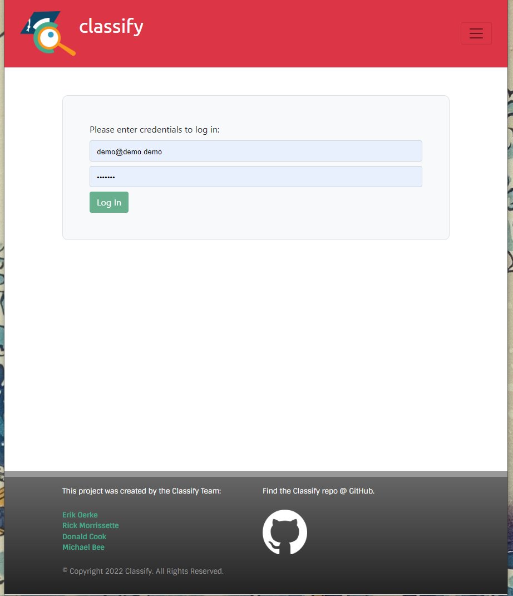
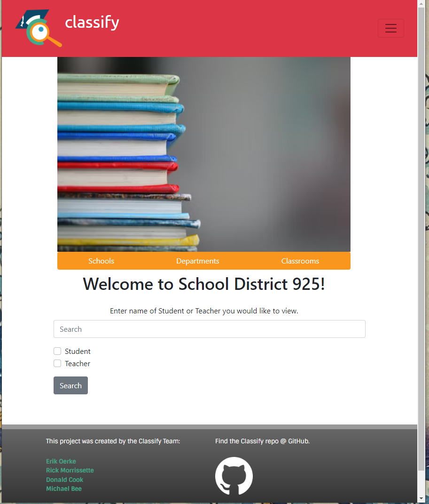
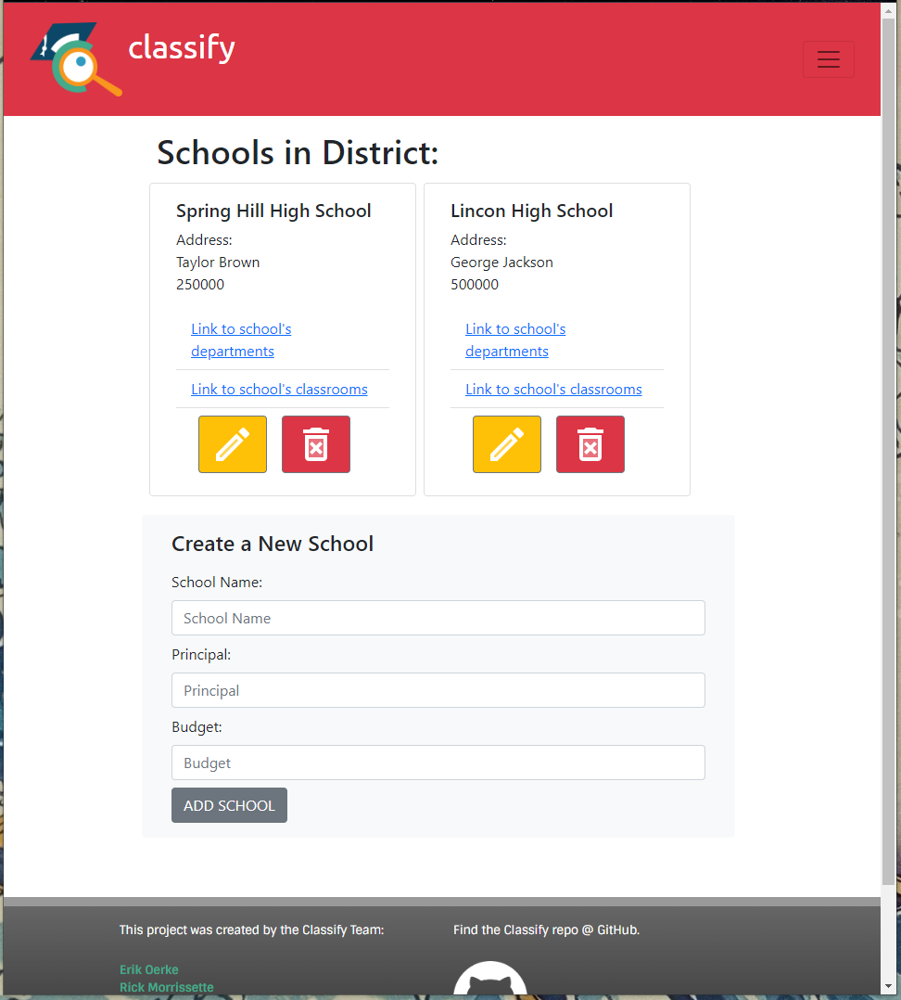

# Classify 

## Description
    WHEN a USER logs into the app
    THEN they are sent to a landing page with options
    WHEN a USER clicks on the Navbar routes change different pages are displayed dynamicly
    USERS can add and delete schools as well as updated what departments are apart of schools
    ADMINS should be able to see a budget associated with the department and school
    
    
## Table of Contents
    
    
- [Installation](#installation)
- [Usage](#usage)
- [Credits](#credits)
- [License](#license)
    
## Installation
    npm i
## Usage
    -git clone to bring the repo down
    -requires react.js 
    -GraphQL
    -MongoDB
    
    
    
    
## Credits

[GitHub Link](https://github.com/dkcook90/Classify_App)
    
    
## License
    MIT
    
    ---
    
    
## Badges 
    
## Features
    NoSLQ Database
    
    
## How to Contribute
    contact rlmor1023@gmail.com
    
## Tests
    no tests available
    

    